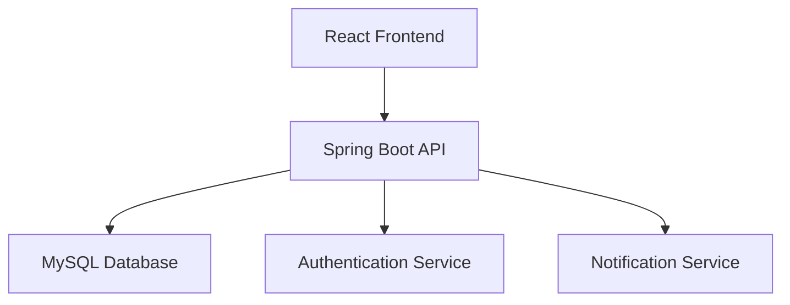

# Software Requirements Specification (SRS)
## Library Management System v1.0

### 1. Introduction
#### 1.1 Purpose
This document specifies the software requirements for the Library Management System.

#### 1.2 Scope
The system will provide comprehensive library management capabilities including user management, book cataloging, transaction processing, and reporting.

#### 1.3 Definitions and Acronyms
- **LMS**: Library Management System
- **API**: Application Programming Interface
- **CRUD**: Create, Read, Update, Delete
- **JWT**: JSON Web Token

### 2. System Architecture
#### 2.1 Technology Stack
- **Frontend**: React 18, Vite, Tailwind CSS
- **Backend**: Spring Boot 3.2, Java 17
- **Database**: MySQL 8.0
- **Authentication**: Spring Security, JWT

#### 2.2 System Components


### 3. Functional Specifications
### 3.1 User Stories

Epic: User Management

- As a new user, I want to register an account so I can access the system  
- As a user, I want to login securely so I can access my account  
- As an admin, I want to manage user roles and permissions  


Epic: Book Management

- As a librarian, I want to add new books to the system
- As a user, I want to search for books by title, author, or genre
- As a user, I want to view book availability status

Epic: Transaction Management

- As a member, I want to borrow available books
- As a member, I want to return borrowed books
- As a librarian, I want to track all book transactions

### 4. Technical Specifications
### 4.1 Database Schema (Initial)
```sql
-- Users table
CREATE TABLE users (
    id BIGINT PRIMARY KEY AUTO_INCREMENT,
    username VARCHAR(50) UNIQUE NOT NULL,
    email VARCHAR(100) UNIQUE NOT NULL,
    password VARCHAR(255) NOT NULL,
    role ENUM('ADMIN', 'LIBRARIAN', 'MEMBER') NOT NULL,
    created_at TIMESTAMP DEFAULT CURRENT_TIMESTAMP
);

-- Books table
CREATE TABLE books (
    id BIGINT PRIMARY KEY AUTO_INCREMENT,
    title VARCHAR(255) NOT NULL,
    author VARCHAR(255) NOT NULL,
    isbn VARCHAR(20) UNIQUE,
    genre VARCHAR(100),
    total_copies INT DEFAULT 1,
    available_copies INT DEFAULT 1,
    created_at TIMESTAMP DEFAULT CURRENT_TIMESTAMP
);

-- Transactions table
CREATE TABLE transactions (
    id BIGINT PRIMARY KEY AUTO_INCREMENT,
    user_id BIGINT NOT NULL,
    book_id BIGINT NOT NULL,
    borrow_date DATE NOT NULL,
    due_date DATE NOT NULL,
    return_date DATE,
    status ENUM('ACTIVE', 'RETURNED', 'OVERDUE') DEFAULT 'ACTIVE',
    FOREIGN KEY (user_id) REFERENCES users(id),
    FOREIGN KEY (book_id) REFERENCES books(id)
);
```
### 4.2 API Endpoints (Planned)
```
Authentication:
POST /api/auth/register
POST /api/auth/login
GET  /api/auth/profile

Books:
GET    /api/books
POST   /api/books
GET    /api/books/{id}
PUT    /api/books/{id}
DELETE /api/books/{id}
GET    /api/books/search

Transactions:
POST /api/transactions/borrow
POST /api/transactions/return
GET  /api/transactions/user/{userId}
GET  /api/transactions/overdue
```
### 5. Quality Assurance
### 5.1 Testing Strategy

- Unit Testing: JUnit (Backend), Jest (Frontend)  
- Integration Testing: TestContainers, React Testing Library  
- End-to-End Testing: Manual testing scenarios  

### 5.2 Performance Requirements

- API response time: < 500ms  
- Page load time: < 2 seconds  
- Database query optimization  
- Efficient pagination for large datasets  

### 6. Deployment Strategy
- Development: Local environment
- Testing: Docker containers
- Production: Cloud deployment (AWS/Azure)
#### 6.1 Create Setup Guide
Create: `README.md` (Update root README)
```
# Library Management System

A full-stack web application for managing library operations built with Spring Boot and React.

## 🏗️ Architecture
- **Frontend**: React 18 + Vite + Tailwind CSS
- **Backend**: Spring Boot 3.2 + Java 17
- **Database**: MySQL 8.0
- **Authentication**: Spring Security + JWT

## 🚀 Quick Start

### Prerequisites
- Java 17+
- Node.js 18+
- MySQL 8.0+
- Maven 3.6+
```
#### Backend Setup
```bash
cd backend
mvn clean install
mvn spring-boot:run
```
Backed Server runs on: http://localhost:8080

#### Frontend Setup
```Bash
cd frontend
npm install
npm run dev
```
Application runs on: http://localhost:5173
Database Setup
```sql
CREATE DATABASE library_management_db;
-- Update application.properties with your MySQL credentials
```

📁 Project Structure
```
library-management-system/
├── backend/           # Spring Boot API
├── frontend/          # React Application  
├── docs/             # Documentation
├── database/         # Database scripts
└── README.md
```

📋 Development Milestones

 Milestone 1: Project Setup (4 hrs)  
 Milestone 2: User Registration & Authentication (6 hrs)  
 Milestone 3: Book Management (Admin) (8 hrs)  
 Milestone 4: Book Search & Borrow/Return (10 hrs)  
 Milestone 5: Overdue Notifications (4 hrs)  
 Milestone 6: Integration, Testing & Documentation (8 hrs)  

👥 Team

Developer: Teo Yong Song  
Project Duration: 40 hours  
Technology Stack: Spring Boot + React + MySQL  

📞 Support
For questions or issues, please refer to the documentation in the docs/ directory.
